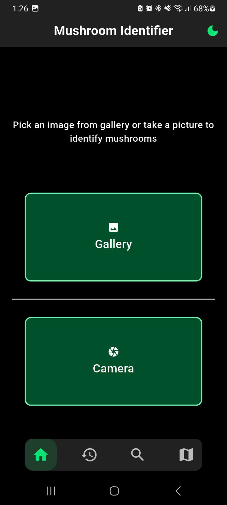
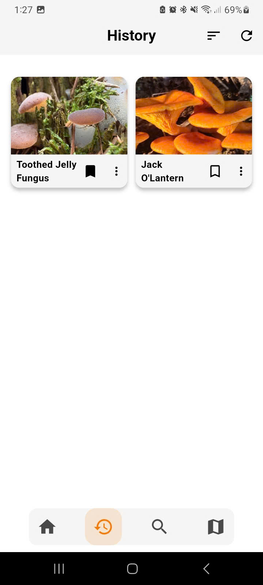
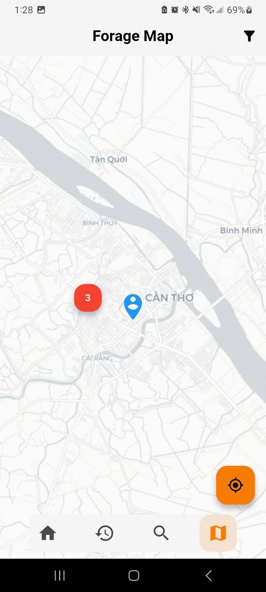

# FungiScan - Mushroom Indentifier Application

  
  
  
  

A mobile mushroom identification app that uses a cloud-hosted Vision Transformer (ViT) model for real-time identification, with results and species data stored locally for offline use. 
The app also features an interactive map (OSM) integrated with the iNaturalist API to allow users to explore nearby forageables. 

## Preview

| Home | Home (Dark Mode) | History | Search | Forage Map |
| ------------------------------------ | ----------------------------------- | -------------------------- | ------------------------- | ----------------------------- |
|  |  |  |  |  |

## Tech stack & Libraries

- [Flutter](https://flutter.dev/) - Cross-platform framework for building the Android mobile application.
- [Dart](https://dart.dev/) - Programming language used with Flutter for client-side development.
- [SQLite](https://sqlite.org/index.html) - Local database for storing identification history and enabling offline access.
- [JSON](https://www.json.org/json-en.html) - Format for bundled mushroom dataset used in search and result population.
- [OpenStreetMap](OpenStreetMap) - Mapping service integrated for interactive forage map display.
- [iNaturalist API](https://pyinaturalist.readthedocs.io/) - Public API for retrieving real-time observation data in the forage map.
- [PyTorch](https://pytorch.org/) - Deep learning framework for model training and inference.
- [Transformers (Hugging Face)](https://huggingface.co/docs/transformers/index) - Library providing pre-trained Vision Transformer models.
- [Matplotlib](https://matplotlib.org/) - Plotting library for generating model evaluation visualizations.
- [CUDA](https://developer.nvidia.com/cuda/) - Parallel computing platform for GPU-accelerated model training.
- [FastAPI](https://fastapi.tiangolo.com/) - Web framework for the server-side API endpoint.
- [Lightning.ai Studios](https://lightning.ai/) - Cloud platform for hosting the model server.
- 

## Features

* **Navigation:**
  * Bottom navigation bar for easy access to different sections of the app.
  * Navigation between screens for home (mushroom identifier), history, search and forage map.

* **Mushroom Identifier:**
  * Access via home screen with options to capture photo using camera or select from gallery.
  * Image adjustment tools including crop, zoom, and rotation to focus on the mushroom.
  * Upload adjusted image to remote server for real-time classification using Vision Transformer model.
  * Display results with detailed species information from bundled JSON dataset and automatic saving to local history.

* **History:**
  * View scrollable list of past identification results stored in SQLite for offline access.
  * Sort entries by name or date and refresh the list using top bar actions.
  * Interact with items through bookmarking, copying content to clipboard, or deletion via context menu.
  * Tap items to access full details or open corresponding external reference page.

* **Search:**
  * Keyword-based lookup using bundled JSON dataset with initial display of sample items.
  * Real-time filtering as keywords (e.g., cap color, smell, habitat, names) are entered in the search bar.
  * Display matching results as cards, tap to view complete species details.
  * Handle no-match scenarios with "No results found" message and option to access external references.

* **Forage Map:**
  * Interactive map centered on user's location, sourcing observations from iNaturalist API.
  * Apply filters for radius, month, observation limit, and taxon scope (mushrooms or all organisms).
  * Display red markers for observations, tap to open bottom sheet with photo, date, names, and link to iNaturalist entry.
  * Refresh markers upon filter changes, with support for online-only operation.
